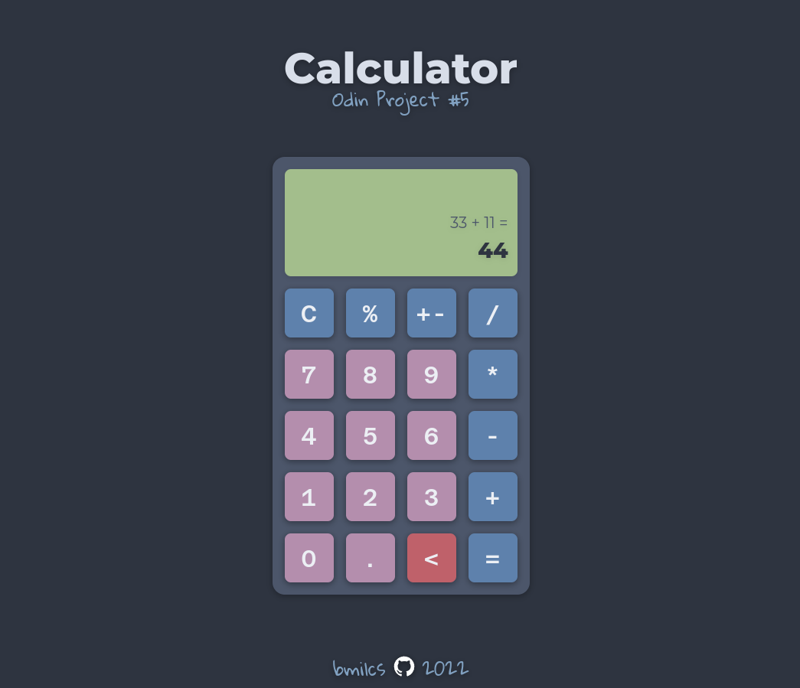

# Odin Project #5: Calculator

Welcome to Bryan Miller's Calculator Project, the [fifth assignment](https://www.theodinproject.com/lessons/foundations-calculator) within the Odin Project curriculum. The goal of this repo is to practice the following skill sets:

- HTML
- CSS
- JavaScript
  - Objects & Arrays
  - Methods
  - Constructors
  - Switches
- Chrome DevTools & Debugging
- Git Fundamentals

# Links

- [Live Demo](https://bmilcs.github.io/odin-calculator/)
- [My Odin Project Progress](https://github.com/bmilcs/op)

## Screenshots



## Deployment

```sh
git clone git@github.com:bmilcs/odin-calculator.git
```
